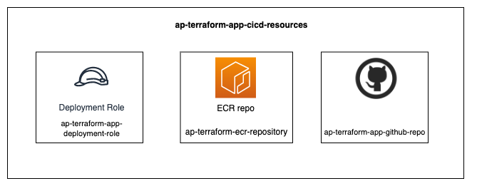

ap-terraform-app-cicd-resources module to combine ap-terraform-ecr-repository, ap-terraform-app-github-repo and ap-terraform-app-deployment-role modules

Note: This module has no provider requirements but the modules called require

github >=4.0

aws ~>3.71.0

<!-- BEGIN_TF_DOCS -->
## Requirements

| Name | Version |
|------|---------|
|  [terraform](#requirement\_terraform) | >= 0.14.0 |

## Providers

No providers.

## Modules

| Name | Source | Version |
|------|--------|---------|
|  [deployment\_role](#module\_deployment\_role) | git@github.com:ministryofjustice/ap-terraform-app-deployment-role.git | v1.1.0 |
|  [ecr\_repository](#module\_ecr\_repository) | git@github.com:ministryofjustice/ap-terraform-ecr-repository.git | v1.1.0 |
|  [github\_repo](#module\_github\_repo) | git@github.com:ministryofjustice/ap-terraform-app-github-repo.git | v1.2.0 |

## Resources

No resources.

## Inputs

| Name | Description | Type | Default | Required |
|------|-------------|------|---------|:--------:|
|  [admin\_team](#input\_admin\_team) | Name of the admin team | `string` | n/a | yes |
|  [application\_name](#input\_application\_name) | Name of the ECRand git repository. | `string` | n/a | yes |
|  [description](#input\_description) | Description for the repository | `string` | n/a | yes |
|  [maintainer\_team](#input\_maintainer\_team) | Name of the maintainer team | `string` | n/a | yes |
|  [openid\_connect\_provider\_arn](#input\_openid\_connect\_provider\_arn) | The ARN of the AWS IAM OpenID connect provider | `string` | n/a | yes |
|  [organisation](#input\_organisation) | The name of the GitHub organisation or user | `string` | n/a | yes |
|  [pull\_arns](#input\_pull\_arns) | List of IAM ARNs that can push and pull images and tags. | `list(string)` | n/a | yes |
|  [push\_arns](#input\_push\_arns) | List of IAM ARNs that can push and pull images and tags. | `list(string)` | n/a | yes |
|  [tags](#input\_tags) | A map of tags to add to the resources | `map(string)` | `{}` | no |
|  [template\_owner](#input\_template\_owner) | Name of the organisation owning the template repository | `string` | n/a | yes |
|  [template\_repository](#input\_template\_repository) | Name of the template repository to use | `string` | n/a | yes |

## Outputs

No outputs.
<!-- END_TF_DOCS -->